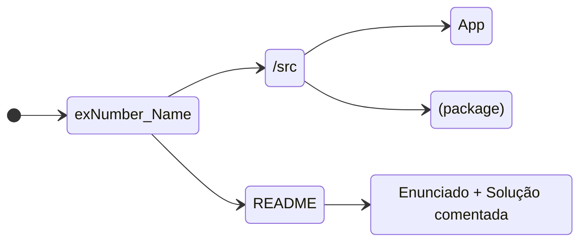

## FORMAÇÃO JAVA - DIGITAL INNOVATION ONE (DIO)

Neste repositório estarão presentes as soluções para os exercícios propostos nos cursos de formação Java da DIO. 

```mermaid
stateDiagram
  direction LR
  [*] --> exNumber_Name
  exNumber_Name --> /src
  /src --> App
  /src --> PackageDescription
  exNumber_Name --> README
  README --> Descricao

  Descricao:Enunciado + Solução comentada
  PackageDescription:(package)
```